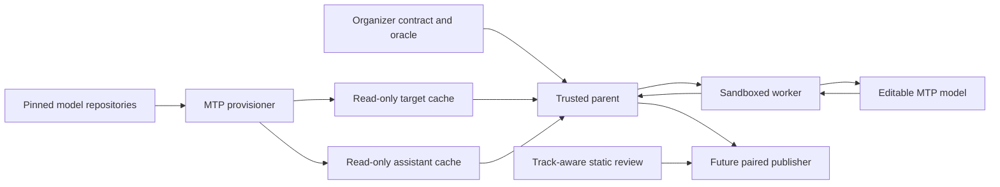

# Gemma 4 MTP Track Threat Model

## Executive summary

The highest risks are integrity attacks that make a candidate appear faster
without performing single-pass target-equivalent inference: prompt lookup,
denominator/timing forgery, unverified draft emission, stale or incorrectly
rolled-back KV state, assistant substitution, and prompt-dependent work moved
before the timer. Phase 1 gives the trusted parent authority over tokens,
elapsed time, and an oracle-bounded configured denominator (default 128,
maximum 512); pins and revalidates the
assistant; and isolates the worker. It cannot prove the internal provenance of
each computation when malicious editable model code still returns correct
oracle tokens, so hidden-independent prompts, static review, M5 telemetry, and
manual audit remain necessary.

The final public/synthetic M5 matrix achieved exact parity across 12
variable-length pairs, but serial-equivalent target verification was slower
than serial in every category (overall ratio-of-means 0.815x). This is a
correctness-complete experimental control and must not be promoted as a
rankable performance track until a bit-identical K-row target kernel exists.

## Scope and assumptions

In scope:

- `Sources/MLXFastModel/Gemma4MTPRuntime.swift`
- `Sources/MLXFastHarness/GemmaRuntimeMTP*.swift`
- `Sources/MLXFastHarness/GemmaRuntimeWorker.swift`
- `Sources/MLXFastCLI/main.swift`
- `setup-mtp.sh` and MTP fixtures
- `.github/scripts/run-submission-static-review.sh`

Runtime, provisioning, and future ranked-CI boundaries are modeled separately.
The existing serial track is in scope only where isolation from MTP can regress.

Assumptions:

- Ranked execution uses the operator-supervised, ephemeral `m5-bench` runner
  described in `AGENTS.md`.
- The target and assistant caches are organizer-owned and read-only to the
  sandboxed benchmark uid.
- Participant control is limited to `benchmark.json` editable paths; trusted
  harness, workflow, contracts, goldens, and score publication are overlaid
  from the organizer.
- The parent serial oracle is generated from the exact pinned 31B-IT target.
- Network denial, uid separation, thermal telemetry, and worker reaping remain
  enabled in any future MTP workflow.

Open questions that affect rollout risk:

- What MTP-specific hidden prompt mix and acceptance distribution will be used?
- Will the official track score decode only or retain the serial
  decode/prefill weighting?
- What active-memory and background-GPU telemetry thresholds will be enforced?

Observed public M5 runs peaked near 47.6 GiB process RSS, 31.2 GiB MLX active
memory, and 34.1 GiB MLX allocator peak. These measurements are below the
128 GiB runner budget but require a separate MTP memory floor/cap before
multi-tenant or lower-memory deployment.

## System model

### Primary components

- MTP provisioner: downloads immutable target/assistant files and verifies
  byte manifests (`setup-mtp.sh`).
- Trusted parent: validates artifacts, owns the oracle/timer/denominator, and
  validates every block (`GemmaRuntimeMTP.swift`).
- Sandboxed worker: loads target and assistant, executes the strict line-JSON
  protocol, and cannot write or use the network
  (`GemmaRuntimeMTPWorker.swift`, `main.swift` sandbox profile).
- Editable MTP model: drafts, verifies, commits, and rolls back target/shared
  KV state (`Gemma4MTPRuntime.swift`).
- Static review: chooses distinct serial or MTP policy from trusted track
  identity (`run-submission-static-review.sh`).
- Future workflow/publisher: not implemented; must pair a trusted MTP
  reference and candidate before score publication.

### Data flows and trust boundaries

- Public model repositories → provisioner: HTTPS model bytes; immutable
  revisions plus checked-in size/SHA256 manifests; resumable local writes.
- Organizer cache → trusted parent: target, assistant, and contract paths;
  regular-file, single-link, inventory, architecture, size, and hash checks.
- Trusted parent → worker: argv paths and line-delimited JSON over private
  pipes; environment allowlist; no future oracle fields.
- Worker → editable model: prompt tokens, last committed token, model weights,
  and within-request state; editable code is untrusted.
- Worker → trusted parent: nonce-bound response ID plus token block; strict
  response schema and bounded line size.
- Trusted oracle → parent only: expected seed and the configured target tokens;
  never sent
  in block requests.
- Parent → future publisher: diagnostic data today; no score until a separate
  baseline and workflow are enabled.

#### Diagram

## Assets and security objectives

| Asset | Why it matters | Security objective |
| --- | --- | --- |
| Serial leaderboard | Must not be changed by an experimental track | Integrity |
| MTP score/timing | Must represent charged single-pass inference | Integrity |
| Serial target oracle | Detects any returned-token divergence | Confidentiality, integrity |
| Target and assistant bytes | Define the model pair and comparable workload | Integrity |
| Target/shared KV state | Determines future logits after accept/reject | Integrity |
| Worker protocol | Carries the only scored model outputs | Integrity, availability |
| M5 compute and memory | Resource abuse can forge speed or deny later jobs | Integrity, availability |
| Runner secrets/private prompts | Submitted code must not read or exfiltrate them | Confidentiality |

## Attacker model

### Capabilities

- Submit arbitrary Swift under the editable model/transform paths.
- Observe all prompt tokens legitimately supplied to the worker.
- Allocate memory, schedule MLX operations, retain within-process state, and
  attempt background work from editable code.
- Return malformed, partial, replayed, or semantically dishonest worker data
  through behavior induced in the model.
- Optimize for known public prompts and known protocol bounds.
- Attempt local path substitution when operator ownership is absent.

### Non-capabilities

- Modify the trusted parent, workflow, contract, oracle, or publisher in an
  accepted official submission.
- Read future oracle tokens through the MTP request schema.
- Use worker network, filesystem writes, or process spawning under the
  required Seatbelt profile.
- Supply an arbitrary assistant through the official organizer cache contract.
- Make an incorrect returned token pass the parent's exact serial oracle.

## Entry points and attack surfaces

| Surface | How reached | Trust boundary | Notes | Evidence |
| --- | --- | --- | --- | --- |
| MTP CLI | Explicit command arguments | Operator → parent | No environment toggle changes serial benchmark | `Sources/MLXFastCLI/main.swift` |
| Artifact directories | Target/assistant paths | Cache → parent/worker | Hash, size, links, inventory, config | `GemmaRuntimeMTPProvenance.swift` |
| Worker request decoder | Private pipe JSON | Parent → worker | Unknown fields and bounds rejected | `GemmaRuntimeWorker.swift` |
| Worker response decoder | Private pipe JSON | Worker → parent | Unknown timing/count fields rejected | `GemmaRuntimeWorker.swift` |
| Draft/verify round | Editable Swift calls pinned MLX APIs | Worker → untrusted model | Internal computation not directly attestable | `Gemma4MTPRuntime.swift` |
| KV rollback | Acceptance-dependent cache trim | Editable model state | Host offsets checked; physical semantics need runtime tests | `Gemma4MTPRuntime.swift` |
| Static-review track ID | Trusted environment | Workflow → review service | Defaults to serial; unsupported IDs fail | `run-submission-static-review.sh` |
| Provisioning download | HTTPS and local cache writes | Repository → operator cache | Resume plus exact SHA256; TOCTOU depends on ownership | `setup-mtp.sh` |

## Top abuse paths

1. Denominator forgery: candidate returns fake token counts or elapsed seconds
   → parent ignores/rejects fields → configured parent total and wall clock prevent
   score inflation.
2. Oracle smuggling: candidate induces future-token fields in a request →
   strict request schema rejects unknown fields → worker sees only committed
   history.
3. Unverified draft emission: editable code returns assistant tokens directly
   → any mismatch fails parent oracle; lookup that predicts exact hidden output
   remains a static/hidden-prompt concern.
4. Rollback corruption: candidate verifies several rows but keeps rejected
   physical KV state → later logits normally diverge and fail oracle; carefully
   hidden stale buffers require cache instrumentation/manual review.
5. Prompt specialization: candidate hashes the 512-token prompt and returns a
   known continuation → public prompt can be gamed → hidden,
   prompt-independent cases and static review are mandatory.
6. Pre-timer work: candidate starts prompt-dependent drafting before the
   parent timer → worker receives no prompt before timed begin; background
   process/global state still requires fresh-process and telemetry controls.
7. Assistant substitution: candidate points at smaller/custom weights or adds
   an extra sidecar → trusted argv, exact inventory/hash/config, revalidation,
   and read-only ownership fail closed.
8. TOCTOU replacement: local attacker swaps a path after validation → worker
   rehashes after model load and resident tensors become path-independent;
   official ownership prevents concurrent replacement.
9. Memory bomb/cache subsidy: initialization retains huge free buffers or
   active asynchronous allocations → allocator free cache is cleared at begin;
   active state is only partly observable and needs M5 limits/telemetry.
10. Serial-track contamination: code routes ordinary `benchmark` into MTP →
    distinct option types, subcommands, protocol kinds, default serial static
    policy, and regression tests prevent implicit opt-in.

## Threat model table

| Threat ID | Threat source | Prerequisites | Threat action | Impact | Impacted assets | Existing controls | Gaps | Recommended mitigations | Detection ideas | Likelihood | Impact severity | Priority |
| --- | --- | --- | --- | --- | --- | --- | --- | --- | --- | --- | --- | --- |
| TM-001 | Participant | Known or fingerprintable prompt | Lookup/hardcode exact continuation | Fake speed with correct output | Score, leaderboard | No future oracle; static policy; parent oracle | Public prompt remains known | Multiple hidden-independent prompts; diff review; reject large lookup data | Acceptance/block patterns and source-size anomalies | High | High | Critical |
| TM-002 | Participant | Editable MTP round | Return drafts without target verification or use stale logits | Incorrect inference accepted if tokens happen to match | Score, model integrity | Parent checks every token; MTP static policy | Parent cannot observe internal target calls | Hidden near-tie/diverse prompts; manual target-call audit; optional trusted kernel counters outside editable code | Compare target execution telemetry to reference | Medium | High | High |
| TM-003 | Participant | Partial/zero acceptance | Leave cache physically or logically over-advanced | Future logits corrupt or hidden work is reused | KV state, score | Every target row uses the exact serial K=1 reduction shape; verification stops at first rejection; host offset checks; poison on error | Future optimized K-row kernels would reopen shape-parity risk | Runtime-gated zero/partial/full and variable-tail parity tests | Cache-offset, physical-state, and oracle assertions | Medium | High | High |
| TM-004 | Participant/local attacker | Writable artifact paths | Replace/add assistant or race path validation | Easier workload or malicious model | Model provenance, score | Exact ID/hash/size/config/inventory; no links; pre/post-load digest | Path loader is not descriptor-bound | Root-owned read-only cache; immutable volume; compare inode metadata around load | Provisioning audit and digest log | Low officially, medium locally | High | High |
| TM-005 | Participant | Worker controls response behavior | Forge counts, seconds, nonce/ID, empty/oversized/partial blocks | Denominator or timing manipulation, hangs | Protocol, score, availability | Strict schema; nonce/ID; watchdog; bounds; fixed denominator | Deliberate slow responses still consume queue | Per-request and job timeout; response fuzz suite | Protocol-rejection counters | Medium | Medium | Medium |
| TM-006 | Participant | Prompt supplied at begin | Precompute future tokens before timer or across requests | Uncharged work | Score | Timer before begin; fresh worker; no prompt before timer; allocator clear | Active background GPU allocations are not fully cleared/provable | Process isolation before prompt; active-memory baseline; GPU quiescence check | Metal/GPU activity before begin | Medium | High | High |
| TM-007 | Participant | Known token/block shape | Special-case call count, offset, prompt length, or final tail | Benchmark-only speedup | Score | Trusted totals up to 512; variable 255/256/257 tail tests; static MTP policy | Shape itself is necessarily observable | Rotate hidden lengths and prompts; manual branch audit | Timing discontinuities by shape | High | Medium | High |
| TM-008 | Participant | Resource access in worker | Memory bomb, allocator-state subsidy, background threads | OOM, unfair cache state, runner DoS | M5 availability, score | Sandbox, orphan reaper, allocator clear, watchdog | No hard active-memory cap in Phase 1 | Peak/active memory cap; terminate unexpected threads/process activity; fresh runner | Memory/threads sampled at phase boundaries | Medium | High | High |
| TM-009 | Integration error | Shared CLI/workflow | Enable MTP under serial track or compare to serial baseline | Corrupt existing leaderboard | Serial leaderboard | Separate commands/types/kinds; score disabled; static track default serial | Future workflow not implemented | Dedicated workflow and score namespace; contract tests; release approval | Assert serial source/path hashes and track ID | Low | High | Medium |
| TM-010 | Submitted code | Error/log path sees hidden prompt | Exfiltrate prompt through stderr, DNS, files, or protocol framing | Private benchmark disclosure | Oracle/prompts/secrets | FD isolation, stderr redaction, DNS/network/write/process denial, line bounds | OS sandbox defects remain platform risk | Retain uid/PF/operator sandbox probes; no secret-bearing env | Sandbox probe and egress telemetry | Low | High | Medium |

## Criticality calibration

- Critical: repeatable hidden-prompt lookup or a score-authority bypass that
  publishes a materially false leaderboard result; organizer artifact
  replacement across all jobs.
- High: unverified tokens or rollback corruption that can pass normal checks;
  prompt-dependent pre-timer compute; reliable M5 OOM or private-oracle access.
- Medium: malformed protocol DoS bounded to one job; local-only TOCTOU without
  official ownership; accidental track-mixing caught before publication.
- Low: diagnostics-only inconsistency that cannot affect token parity, timing,
  denominator, artifacts, or publication.

## Focus paths for security review

| Path | Why it matters | Related threats |
| --- | --- | --- |
| `Sources/MLXFastModel/Gemma4MTPRuntime.swift` | Editable draft/verify/rollback and persistent state | TM-001, TM-002, TM-003, TM-006, TM-007 |
| `Sources/MLXFastHarness/GemmaRuntimeMTP.swift` | Trusted timer, oracle, bounds, denominator | TM-001, TM-005, TM-006 |
| `Sources/MLXFastHarness/GemmaRuntimeMTPWorker.swift` | MTP-only request state and poisoning | TM-003, TM-005, TM-008 |
| `Sources/MLXFastHarness/GemmaRuntimeMTPProvenance.swift` | Artifact identity and TOCTOU checks | TM-004 |
| `Sources/MLXFastHarness/GemmaRuntimeWorker.swift` | Shared strict protocol, nonce, environment, process lifecycle | TM-005, TM-010 |
| `Sources/MLXFastCLI/main.swift` | Track dispatch and sandbox profile | TM-006, TM-009, TM-010 |
| `setup-mtp.sh` | Download integrity and cache path safety | TM-004 |
| `.github/scripts/run-submission-static-review.sh` | Distinct serial/MTP allow-deny policy | TM-001, TM-002, TM-003, TM-007, TM-009 |
| `.github/workflows/benchmark.yml` | Future track identity, isolation, pairing, publication | TM-006, TM-008, TM-009, TM-010 |
| `Tests/MLXFastTests/ExperimentalMTPTests.swift` | Adversarial protocol and isolation regression suite | TM-003, TM-004, TM-005, TM-009 |

## Quality check

- Covered CLI, file, protocol, model-state, static-review, and future CI entry
  points.
- Represented every cache/repository/parent/worker/model/publisher boundary in
  at least one threat.
- Separated runtime, provisioning, and future CI/publication controls.
- Kept supplied deployment assumptions explicit; unanswered rollout choices
  remain open questions.
- Distinguished parent-provable properties from editable internal behavior
  that still requires audit and hidden testing.
